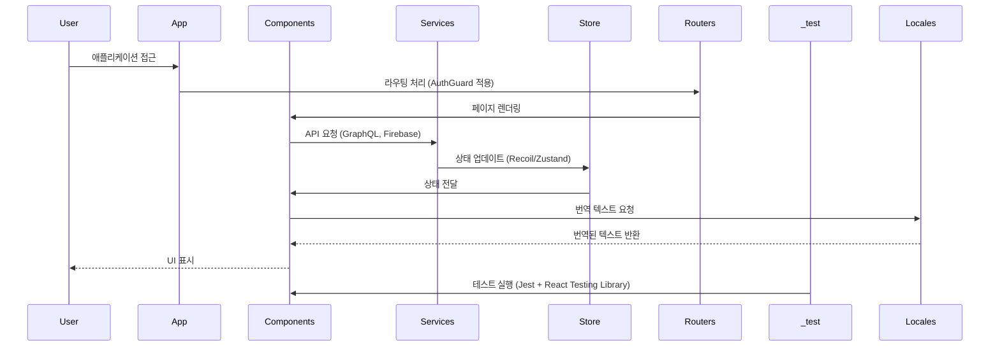

# services/modiplanet-gui/src 디렉토리 README

---

## 1. 제목 및 개요

**프로젝트 이름**: `LMS-Client / modiplanet-gui`  
**한 줄 설명**: MODIPLANET GUI 애플리케이션의 핵심 로직, UI, 상태 관리, 테스트, 국제화 등을 통합한 모듈.

### 주요 기능
- **인증 및 사용자 관리**: Google, Apple, Kakao 인증, 사용자 프로필 관리
- **UI/UX 컴포넌트**: 재사용 가능한 버튼, 입력 필드, 모달, 툴팁, 칩, 진행률 표시 등
- **상태 관리**: Recoil 및 Zustand 기반의 전역 상태 관리 (모달, 사용자 프로필, 화상강의 상태 등)
- **국제화**: `en-US`, `ko-KR`, `es`, `pl` 등 다국어 지원
- **테스트**: Jest + React Testing Library 기반의 단위/이нтег레이션 테스트
- **API 통합**: Apollo Client, Firebase, GraphQL 기반의 서버 통신
- **라이브 강의**: LiveKit 기반의 실시간 영상/오디오 처리

### 기술 스택
- **Frontend**: React, TypeScript, React Router, Apollo Client, Firebase
- **State Management**: Recoil, Zustand
- **UI Library**: @nextui-org/react, react-split-pane, Tiptap
- **Testing**: Jest, React Testing Library, @testing-library/jest-dom
- **Internationalization**: i18next
- **Live Video**: LiveKit SDK

---

## 2. 아키텍처 개요

```mermaid
graph TD
    A["main App"] --> B["components/"]
    A --> C["lib/"]
    A --> D["locales/"]
    A --> E["pages/"]
    A --> F["routers/"]
    A --> G["services/"]
    A --> H["store/"]
    A --> I["_test/"]
    A --> J["style/"]

    B["components/"] --> B1["hooks/"]
    B1 --> B1a["useAIUploader.ts"]
    B1 --> B1b["useGoogleAuth.ts"]
    B --> B2["provider/"]
    B2 --> B2a["AuthProvider.tsx"]
    B2 --> B2b["firebase-provider.tsx"]
    B --> B3["ui/"]
    B3 --> B3a["ButtonUI.tsx"]
    B3 --> B3b["InputUI.tsx"]

    C["lib/"] --> C1["constants/"]
    C1 --> C1a["enums.ts"]
    C1 --> C1b["error.ts"]
    C --> C2["livekit-modules/"]
    C2 --> C2a["room-provider.tsx"]
    C --> C3["types/"]
    C3 --> C3a["auth.type.ts"]
    C3 --> C3b["modi-data.ts"]

    D["locales/"] --> D1["en-US/"]
    D1 --> D1a["translation.json"]
    D --> D2["ko-KR/"]
    D2 --> D2a["translation.json"]

    E["pages/"] --> E1["account/"]
    E1 --> E1a["delete-account-button.tsx"]
    E --> E2["room/"]
    E2 --> E2a["livekit-room-container.tsx"]
    E --> E3["study-room/"]
    E3 --> E3a["CoursesTab.tsx"]

    F["routers/"] --> F1["Routers.tsx"]
    F1 --> F1a["AuthGuard.tsx"]
    F1 --> F1b["MODIPlanetLayout.tsx"]

    G["services/"] --> G1["api/"]
    G1 --> G1a["useCourse.ts"]
    G1 --> G1b["useContactConnection.ts"]
    G --> G2["client-model/"]
    G2 --> G2a["courseDetailMapper.ts"]
    G --> G3["gen/"]
    G3 --> G3a["gen.ts"]

    H["store/"] --> H1["recoil/"]
    H1 --> H1a["common/modal.ts"]
    H1 --> H1b["pages/room/livekit.ts"]
    H --> H2["zustand/"]
    H2 --> H2a["ai/ModiDataHandler.ts"]
    H2 --> H2b["user/token.ts"]

    I["_test/"] --> I1["signinTextField.test.tsx"]
    I1 --> I1a["errorMock.ts"]
    I1 --> I1b["wrapper.tsx"]

    J["style/"] --> J1["index.css"]
    J1 --> J1a["font.css"]
    J1 --> J1b["typography.css"]
```



### 모듈 역할 설명
- **components/**: 재사용 가능한 UI 컴포넌트와 로직 훅 제공
- **lib/**: 공통 상수, 유틸리티, LiveKit 통합, 타입 정의
- **locales/**: 다국어 지원을 위한 번역 파일
- **pages/**: 사용자 계정, 코스, 화상강의, 연락처 등 주요 기능 페이지
- **routers/**: 라우팅 구조 정의 및 인증 처리
- **services/**: GraphQL API 호출, 데이터 변환, 비즈니스 로직
- **store/**: Recoil/Zustand 기반의 전역 상태 관리
- **_test/**: 테스트 코드 및 테스트 환경 설정
- **style/**: 글꼴, CSS, 스플릿 팬 UI 스타일 정의

---

## 3. 모듈 요약 테이블

| 모듈 | 목적 | 주요 인터페이스 |
|------|------|----------------|
| `_test/` | 테스트 코드 및 환경 설정 | `signinTextField.test.tsx`, `errorMock.ts`, `wrapper.tsx` |
| `components/` | 재사용 가능한 UI/UX 컴포넌트 및 훅 제공 | `useAIUploader.ts`, `AuthProvider.tsx`, `ButtonUI.tsx` |
| `lib/` | 공통 상수, 유틸리티, LiveKit 통합, 타입 정의 | `constants/enums.ts`, `livekit-modules/components/room-provider.tsx`, `types/auth.type.ts` |
| `locales/` | 다국어 지원을 위한 번역 파일 제공 | `en-US/translation.json`, `ko-KR/translation.json` |
| `pages/` | 사용자 계정, 코스, 화상강의 등 주요 기능 페이지 | `account/components/delete-account-button.tsx`, `room/components/livekit-room-container.tsx` |
| `routers/` | 라우팅 구조 정의 및 인증 처리 | `Routers.tsx`, `AuthGuard.tsx`, `MODIPlanetLayout.tsx` |
| `services/` | GraphQL API 호출, 데이터 변환, 비즈니스 로직 | `api/course/useCourse.ts`, `client-model/course/courseDetailMapper.ts` |
| `store/` | 전역 상태 관리 (Recoil/Zustand 기반) | `recoil/common/modal.ts`, `zustand/ai/ModiDataHandler.ts` |
| `style/` | 글꼴, CSS, 스플릿 팬 UI 스타일 정의 | `index.css`, `font.css`, `typography.css` |

---

## 4. 시작하기

### 사전 요구사항
- Node.js 18+
- npm 또는 yarn
- React, TypeScript, Apollo Client, Firebase, LiveKit SDK 설치

### 설치 / 빌드
```bash
npm install
# 또는
yarn install
```

### 설정
- 환경 변수 설정: `.env` 파일 생성
- 국제화 설정: `src/lib/i18n.ts`에서 언어 설정
- Apollo Client 설정: `src/components/provider/apollo/index.tsx`에서 GraphQL 엔드포인트 지정

---

## 5. 사용법

### 실행 방법
```bash
npm run dev
# 또는
yarn dev
```

### API 엔드포인트
- **GraphQL**: `services/api/*` 디렉토리 내 `useCourse`, `useContactConnection` 등
- **LiveKit**: `lib/livekit-modules/components/` 내 `room-provider.tsx`에서 방 생성/관리

### 포트 정보
- 개발 서버: `localhost:3000`

---

## 6. 데이터 흐름



---

## 7. 배포

- **빌드 명령어**:
  ```bash
  npm run build
  # 또는
  yarn build
  ```

- **CI/CD**: 프로젝트 전체 CI/CD 파이프라인 참고 (`.github/workflows`)

---

## 8. 개발

### 빌드, 테스트, 기여 안내
- **개발 서버 실행**:
  ```bash
  npm run dev
  # 또는
  yarn dev
  ```

- **테스트 실행**:
  ```bash
  npm test
  # 또는
  yarn test
  ```

- **E2E 테스트**:
  ```bash
  npm run test:e2e
  # 또는
  yarn test:e2e
  ```

- **기여 가이드**:
  - `components/`에 새로운 UI 컴포넌트 추가
  - `services/api/`에 새로운 API 호출 로직 구현
  - `store/`에 새로운 상태 관리 로직 추가
  - `locales/`에 새로운 언어 번역 파일 추가

---

이 README는 `services/modiplanet-gui/src` 디렉토리의 핵심 기능, 아키텍처, 모듈 역할, 데이터 흐름, 개발/테스트 방법을 종합적으로 설명합니다. 각 하위 모듈의 README를 기반으로 한 정보를 통합하여 작성되었습니다.