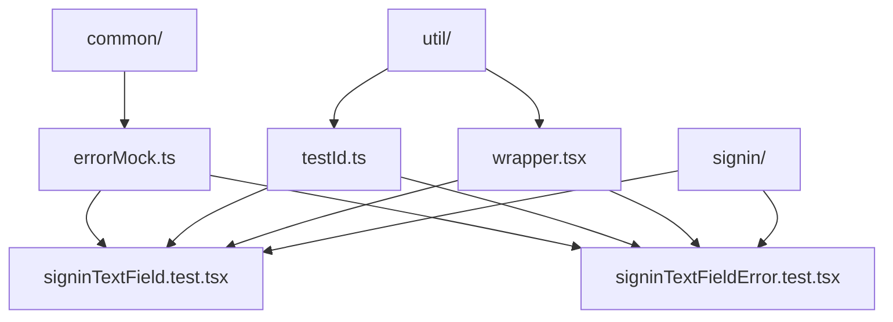
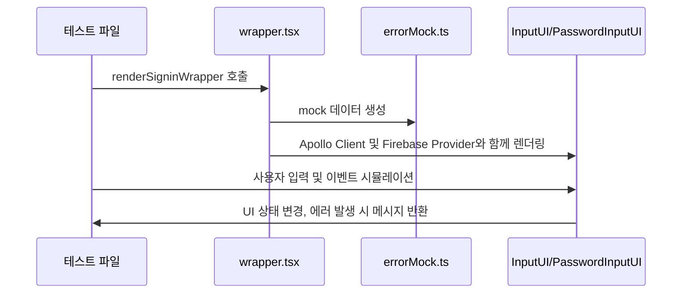

# services/modiplanet-gui/src/_test 디렉토리 README

---

## 1. 제목 및 목적
이 디렉토리는 **모디플래닛 GUI 애플리케이션의 테스트 코드**를 담고 있습니다.  
로그인 페이지의 입력 필드 동작, 에러 핸들링, UI 컴포넌트 테스트를 수행하며, Apollo Client와 React Testing Library 기반의 단위 테스트를 제공합니다.

---

## 2. 아키텍처

---

## 3. 주요 컴포넌트

| 파일/모듈 이름         | 설명                                                                 |
|------------------------|----------------------------------------------------------------------|
| `errorMock.ts`         | GraphQL 에러를 모킹하는 클래스. 테스트 시 서버 응답을 가상화합니다. |
| `testId.ts`            | 테스트용 UI 요소의 `data-testid` 값을 정의합니다.                    |
| `wrapper.tsx`          | Apollo Client와 Firebase 인증을 포함한 테스트 환경을 제공합니다.    |
| `signinTextField.test.tsx` | 이메일/비밀번호 입력 필드의 UI 동작(입력, X 버튼 클릭 등)을 테스트합니다. |
| `signinTextFieldError.test.tsx` | 로그인 요청 시 발생하는 에러 메시지 및 처리 동작을 테스트합니다. |

---

## 4. 데이터 흐름 / 프로세스

---

## 5. 의존성

### 내부 의존성
- `@src/components/ui/Input/*` (테스트 대상 UI 컴포넌트)
- `@src/pages/sign-in/SignInComponent` (로그인 페이지 컴포넌트)
- `@src/_test/signin/util/*` (공유 유틸리티)

### 외부 의존성
- `@apollo/client/testing` (GraphQL 요청 모킹)
- `@testing-library/react` (React 컴포넌트 테스트)
- `react-router-dom` (라우팅 테스트 지원)

---

## 6. 실행 / 테스트 방법
- **테스트 실행**: 프로젝트 루트에서 `npm test` 또는 `yarn test` 명령어 실행 시 자동으로 포함됩니다.
- **단위 테스트**: `signinTextField.test.tsx` 및 `signinTextFieldError.test.tsx` 파일을 직접 실행 가능합니다.

--- 

> 참고: 이 디렉토리의 테스트는 `services/modiplanet-gui` 모듈의 UI/UX 동작과 에러 처리 로직을 검증하는 데 초점을 맞추고 있습니다.