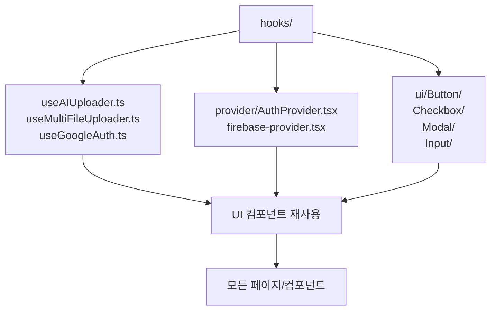

# services/modiplanet-gui/src/components 디렉토리 README

---

## 1. 제목 및 목적

이 디렉토리는 LMS 클라이언트 애플리케이션에서 공유되는 **React 컴포넌트, 훅, 프로바이더**를 모아두는 핵심 모듈입니다.  
**주요 역할**: 인증, 파일 업로드, UI 요소, 상태 관리, 이벤트 처리 등 반복되는 로직과 UI 요소를 재사용 가능한 형태로 제공합니다.

---

## 2. 아키텍처

---

## 3. 주요 컴포넌트

| 유형       | 이름                                | 설명                                                                 |
|------------|-------------------------------------|----------------------------------------------------------------------|
| **Hooks**  | `useAIUploader`                     | AI 모델 파일 업로드를 위한 Presigned URL 생성 및 업로드 처리 로직 제공 |
|            | `useMultiFileUploader`              | 여러 파일을 동시에 업로드하는 훅 (Presigned URL 병렬 처리)            |
|            | `useGoogleAuth`                     | Google OAuth 인증 흐름을 관리하는 훅                                 |
|            | `useBlockCode`                      | 입력 필드를 블록 형태로 분할하여 입력하는 로직 (인증 코드 입력 등)   |
| **Providers** | `AuthProvider`                    | 인증 상태를 전역으로 관리하는 React Context 프로바이더              |
|            | `firebase-provider.tsx`             | Firebase 인증 및 상태 관리 로직을 공유하는 프로바이더                |
| **UI**     | `ButtonUI`, `InputUI`, `ModalUI`    | 재사용 가능한 버튼, 입력 필드, 모달 컴포넌트                        |
|            | `ChipUI`, `ProgressUI`, `TooltipUI` | 텍스트 칩, 진행률 표시, 툴팁 등 디자인 요소 제공                     |

---

## 4. 의존성

### 내부 의존성
- `@services/api/*` (업로드, 인증 API)
- `@src/lib/utils/*` (로컬라이제이션, 유틸리티 함수)
- `@src/store/recoil/*` (상태 관리)

### 외부 의존성
- `react`, `react-router-dom`
- `@react-oauth/google` (Google OAuth)
- `apollo-client` (GraphQL 쿼리/뮤테이션)
- `firebase` (인증, 데이터베이스)

---

## 5. 실행 / 테스트 방법

- **테스트**: 프로젝트 루트에서 `npm run test` 또는 `yarn test`로 실행 (Jest + React Testing Library)
- **개발 시**: `npm run dev` 또는 `yarn dev`로 전체 앱 실행 후 이 디렉토리 내 컴포넌트 재사용 확인

---

## 6. 참고 사항

- `ui_old/` 디렉토리: 이전 버전의 UI 컴포넌트 (대체 예정)
- `hooks/user/` 디렉토리: 사용자 인증, 이메일 인증 등 특정 로직 집중 관리

--- 

이 디렉토리는 LMS 클라이언트의 핵심 로직과 UI 재사용성을 높이기 위해 설계되었습니다.