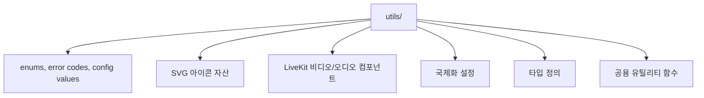
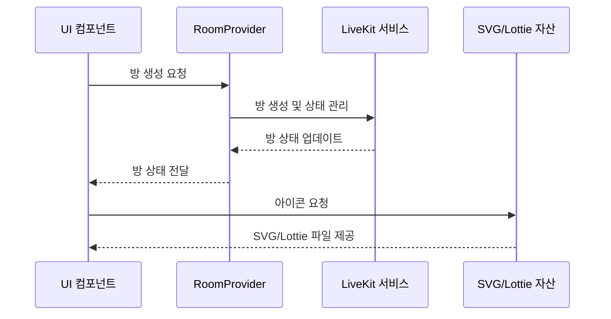

# services/modiplanet-gui/src/lib 디렉토리 README

## 1. 제목 및 목적
이 디렉토리는 MODIPLANET GUI 애플리케이션의 공통 기능, UI 자산, 인터페이스, 및 LiveKit 통합을 위한 라이브러리 모듈입니다.  
프로젝트 내에서 공유되는 상수, 유틸리티, 국제화 설정, 라이브 비디오 기능 등을 제공합니다.

---

## 2. 아키텍처

---

## 3. 주요 컴포넌트

| 파일/디렉토리 | 설명 |
|--------------|------|
| `constants/character.ts` | 캐릭터 정보(이름, 닉네임, 썸네일 등) 정의 |
| `constants/enums.ts` | 프로젝트 전역 enum 정의 (언어, 상태, 타입 등) |
| `constants/error.ts` | 사용자, 쿠폰, 서버 관련 에러 코드 정의 |
| `livekit-modules/components/` | LiveKit 방 생성/관리, 오디오/비디오 렌더링 컴포넌트 |
| `newAssets/` | SVG 아이콘 및 Lottie 애니메이션 자산 집합 |
| `types/` | GraphQL, 모듈, 서비스 관련 TypeScript 타입 정의 |
| `utils/PostMessageReceiver.ts` | 부모-자식 iframe 간 메시지 전송 유틸리티 |

---

## 4. 데이터 흐름 / 프로세스

---

## 5. API / 인터페이스

- **내부 API**
  - `constants/enums.ts`: `ELangType`, `EStorageKey` 등 전역 enum 제공
  - `livekit-modules/components/room-provider.tsx`: `useRoom` 훅을 통해 방 상태 관리

- **외부 설정**
  - `constants/urls.ts`: 카카오, 구글, 애플 인증 URL 및 API 엔드포인트 정의
  - `i18n.ts`: `i18next` 기반 다국어 지원 (ko, en, es, pl)

---

## 6. 의존성

- **내부 의존성**
  - `@services/old/generated/graphql`: GraphQL 타입 정의
  - `@src/lib/constants/enums`: 전역 enum 사용

- **외부 의존성**
  - `react`, `react-i18next`, `livekit-client`, `@livekit/react-components`, `i18next`

---

## 7. 실행 / 테스트 방법

- **테스트**: 프로젝트 전체 테스트 시 `npm run test` 명령어로 자동 포함
- **빌드**: `npm run build` 시 이 디렉토리의 유틸리티/타입이 포함되어 빌드 됨

--- 

이 디렉토리는 MODIPLANET GUI의 핵심 공통 기능을 모듈화하여 재사용성과 유지보수성을 높였습니다.