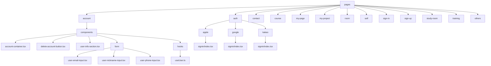

# services/modiplanet-gui/src/pages 디렉토리 README

---

## 1. 제목 및 목적

이 디렉토리는 LMS 클라이언트 애플리케이션의 **주요 페이지 및 UI 컴포넌트**를 담당합니다.  
사용자 계정 관리, 인증, 코스 학습, 연락처 관리, 프로젝트 관리 등 애플리케이션의 핵심 기능을 구성하는 UI 레이아웃과 컴포넌트를 포함합니다.

---

## 2. 아키텍처



---

## 3. 주요 컴포넌트

| 경로 | 설명 |
|------|------|
| `account/components/account-container.tsx` | 사용자 계정 정보를 표시하는 루트 컨테이너 |
| `account/components/delete-account-button.tsx` | 계정 탈퇴 버튼 및 모달 로직 |
| `account/hooks/useUser.ts` | 사용자 정보를 GraphQL로 조회하는 훅 |
| `auth/apple/signin/index.tsx` | Apple 로그인 처리 페이지 |
| `contact/ContactContainer.tsx` | 연락처 목록을 표시하는 컨테이너 |
| `contact/create/ContactForm.tsx` | 연락처 생성 폼 |
| `course/components/CourseHeader.tsx` | 코스 상세 정보 헤더 |
| `my-page/MyPageComponent/UserInfoComponent/index.tsx` | 사용자 프로필 정보 컴포넌트 |
| `room/components/livekit-room-container.tsx` | 실시간 강의 방 컨테이너 |
| `self/api/useActivity.ts` | 학습 내역 API 호출 훅 |

---

## 4. 의존성

### 내부 의존성
- `@hooks/useTranslator` (번역 기능)
- `@services/api` (GraphQL 및 API 요청)
- `@components/ui_old/*` (공통 UI 컴포넌트)
- `@store/recoil` (상태 관리)

### 외부 의존성
- `react-hook-form` (폼 관리)
- `react-router-dom` (라우팅)
- `apollo-client` (GraphQL 통신)

---

## 5. 실행 / 테스트 방법

- **개발 서버 실행**:  
  ```bash
  npm run dev
  ```
- **단위 테스트**:  
  ```bash
  npm run test:unit
  ```
- **E2E 테스트**:  
  ```bash
  npm run test:e2e
  ```

---

## 참고
- 이 디렉토리는 애플리케이션의 **UI 레이아웃과 기능별 페이지**를 구성합니다.  
- 각 하위 디렉토리(`account`, `auth`, `course` 등)는 특정 기능 집합을 담당하며,  
  공통 로직은 `@hooks`, `@components`, `@services` 등 상위 디렉토리에서 공유됩니다.