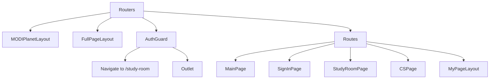
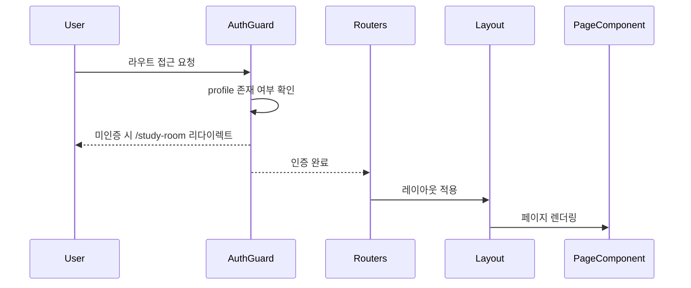

# services/modiplanet-gui/src/routers 디렉토리 README

---

### 1. 제목 및 목적
이 디렉토리는 **MODIPlanet GUI 애플리케이션의 라우팅 구조를 정의**하는 역할을 합니다.  
프로젝트 내에서 사용자 인증, 레이아웃 적용, 페이지 전환을 처리하며, 주요 기능별 라우트를 집중적으로 관리합니다.

---

### 2. 아키텍처

---

### 3. 주요 컴포넌트

| 이름         | 설명                                                                 |
|--------------|----------------------------------------------------------------------|
| `Routers`    | 라우트 정의의 핵심 컴포넌트. `Routes` 및 `Route`를 사용해 페이지 구조를 정의합니다. |
| `AuthGuard`  | 사용자 인증 상태를 확인하고, 미인증 시 `/study-room`으로 리다이렉트합니다. |
| `MODIPlanetLayout` | 전체 애플리케이션의 기본 레이아웃을 제공합니다. |
| `FullPageLayout`   | 전면 페이지(예: 로그인, 가입)에 사용되는 레이아웃입니다. |
| `Lazy-loaded Pages` | `TestPage`, `SignInPage`, `StudyRoomPage` 등 주요 페이지 컴포넌트. |

---

### 4. 데이터 흐름 / 프로세스

---

### 5. 의존성

#### 내부 의존성
- `@components/ui_old/layout/*`: 레이아웃 컴포넌트
- `@src/store/zustand/user`: 사용자 프로필 상태 관리
- `@src/pages/*`: 라우트에 연결된 페이지 컴포넌트

#### 외부 의존성
- `react`, `react-router-dom`, `i18next` (번역 지원)
- `zustand` (상태 관리)

---

### 6. 실행 / 테스트 방법
이 디렉토리는 프로젝트 전체 실행 시 자동으로 포함됩니다.  
테스트를 원할 경우, 프로젝트 루트에서 `npm run test`를 실행해 전체 테스트 스위트를 실행하세요.