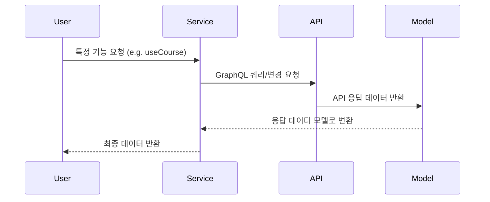

# services/modiplanet-gui/src/services 디렉토리 README

---

### 1. 제목 및 목적  
이 디렉토리는 LMS-Client 애플리케이션의 핵심 서비스 로직을 담당합니다.  
GraphQL API 호출, 데이터 변환, 상태 관리, 인증 처리 등의 기능을 제공하며,  
프로젝트 내에서 **모든 비즈니스 로직과 API 연동을 처리하는 핵심 모듈**로 작동합니다.

---

### 2. 아키텍처  

```mermaid
graph TD
    A["services/"] --> B["api/"]
    A --> C["client-model/"]
    A --> D["gen/"]
    A --> E["old/"]
    A --> F["schema/"]
    
    B --> B1["ai/"]
    B --> B2["contact/"]
    B --> B3["course/"]
    B --> B4["modi/"]
    B --> B5["project/"]
    B --> B6["support/"]
    B --> B7["upload/"]
    B --> B8["user/"]
    
    C --> C1["contact/"]
    C --> C2["course/"]
    C --> C3["project/"]
    C --> C4["signup/"]
    C --> C5["user/"]
    
    D --> D1["gen.ts"]
    D --> D2["gen_prod.ts"]
    
    E --> E1["generated/"]
    E --> E2["schema/"]
    
    F --> F1["ai/"]
    F --> F2["course/"]
    F --> F3["library/"]
    F --> F4["modiData/"]
    F --> F5["myProject/"]
    F --> F6["support/"]
    F --> F7["upload/"]
    F --> F8["user/"]
```


---

### 3. 주요 컴포넌트  

| 파일/디렉토리 | 설명 |
|--------------|------|
| `api.util.ts` | API 요청/응답 공통 유틸리티 (토큰 관리, 에러 처리, 결과 검증 등) |
| `api/` 디렉토리 | 각 기능별 서비스 로직 (course, contact, user 등) |
| `client-model/` 디렉토리 | API 응답 데이터를 클라이언트 모델로 매핑하는 Mapper |
| `gen/` 디렉토리 | GraphQL 쿼리/변경 요청 코드 자동 생성 (Apollo Client 기반) |
| `schema/` 디렉토리 | GraphQL 스키마 정의 파일 (기능별 쿼리/변경 요청 정의) |

---

### 4. 데이터 흐름 / 프로세스  


---

### 5. API / 인터페이스  
- **공개 인터페이스**:  
  - `useCourse`, `useContactConnection`, `useCreateContact`, `useMyCourseDetail` 등  
  - Apollo Client 기반의 React Hook으로, GraphQL 쿼리/변경 요청을 처리  
  - `onCompleted`, `onError` 등 콜백 옵션 지원  

- **GraphQL 엔드포인트**:  
  - `schema/` 및 `gen/` 디렉토리 내에 정의된 쿼리/변경 요청  
  - 예: `course/course.query.graphql`, `user/auth.mutation.graphql`  

---

### 6. 의존성  
- **내부 의존성**:  
  - `@src/lib/constants/cookie.const` (쿠키 관리)  
  - `@lib/types/service/res.type` (응답 타입 정의)  
  - `@apollo/client` (GraphQL 요청 처리)  

- **외부 의존성**:  
  - `typescript-cookie` (쿠키 처리)  
  - `dayjs` (시간 처리)  
  - `graphql` (GraphQL 요청 파싱)  

---

### 7. 실행 / 테스트 방법  
- **테스트**: 프로젝트 전체 테스트 스위트 실행 (예: `npm run test`)  
- **호출 예시**:  
  ```ts
  import { useCourse } from '@services/api/course/course/useCourse';
  const { getCourse } = useCourse();
  getCourse('course-123');
  ```