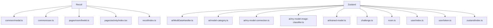

# services/modiplanet-gui/src/store 디렉토리 README

---

### 1. 제목 및 목적
- **LMS 클라이언트 애플리케이션의 전역 상태 관리 모듈**  
  이 디렉토리는 React 애플리케이션에서 사용되는 **Recoil**과 **Zustand** 기반의 상태 관리 로직을 담당합니다. 사용자 프로필, 모달, AI 모델, 화상강의, 퀴즈 등 다양한 기능의 상태를 저장하고 공유합니다.

---

### 2. 아키텍처


---

### 3. 주요 컴포넌트

| 파일/모듈 | 설명 |
|----------|------|
| `recoil/common/modal.ts` | 전역 모달 상태 관리 (BasicModal, SingleButtonModal 등) |
| `recoil/common/user.ts` | 로그인한 사용자 프로필 정보를 로컬스토리지와 연동하여 관리 |
| `recoil/pages/room/livekit.ts` | 화상강의 관련 상태 (장치 설정, 스케줄 정보, 스티커 상태 등) |
| `recoil/pages/activity/index.tsx` | 강의 활동 상태 (PDF, VOD, 퀴즈 등) 및 UI 제어 상태 관리 |
| `zustand/ai/ModiDataHandler.ts` | AI 모델 데이터 핸들러 (데이터 추가/삭제, 상태 관리) |
| `zustand/ai/model-category.ts` | AI 모델 카테고리 선택 상태 관리 |
| `zustand/ai/my-model-connection.ts` | 사용자 정의 AI 모델 연결 상태 및 CRUD 로직 |
| `zustand/challenge.ts` | 퀴즈 응답 상태 및 퀴즈 ID 관리 |
| `zustand/room.ts` | 화상강의 레이아웃, 동기 모드, PIP 상태 등 관리 |
| `zustand/user/token.ts` | 액세스 토큰 및 리프레시 토큰 상태 관리 (만료 체크 포함) |

---

### 4. 의존성

#### 내부 의존성
- `@components/ui_old/modal/*`: 모달 컴포넌트 타입 정의
- `@src/lib/utils/user`: JWT 파싱 로직
- `@src/lib/constants/enums`: 저장소 키 및 열거형 상수
- `@services/old/generated/graphql`: GraphQL 타입 및 쿼리

#### 외부 의존성
- `recoil`: React 상태 관리 라이브러리
- `zustand`: 상태 관리 라이브러리
- `livekit-client`: 화상강의 기능
- `wavesurfer.js`: 오디오 시각화 라이브러리

---

### 5. API / 인터페이스
- **공개 상태**:  
  - `modalState`: 모달 상태 배열  
  - `profileState`: 사용자 프로필 정보  
  - `roomScheduleState`: 화상강의 스케줄 정보  
  - `activityState`: 강의 활동 상태 (PDF, VOD 등)  
  - `useModiDataHandler`: AI 모델 데이터 핸들러  
  - `useSelectedModelCategory`: AI 모델 카테고리 선택 상태  
  - `useTrainingLogs`: 훈련 로그 관리  
  - `useTokenStore`: 액세스/리프레시 토큰 상태 및 만료 체크

---

### 6. 실행 / 테스트 방법
- **테스트**:  
  상태 로직은 Jest와 React Testing Library로 테스트 가능. 예시:
  ```bash
  npm test services/modiplanet-gui/src/store
  ```
- **개발 시 활용**:  
  상태는 `@src/store/recoil/index.ts` 또는 `@src/store/zustand/index.ts`에서 가져와 사용. 예:
  ```ts
  import { useProfileStore } from '@src/store/zustand/user';
  ```