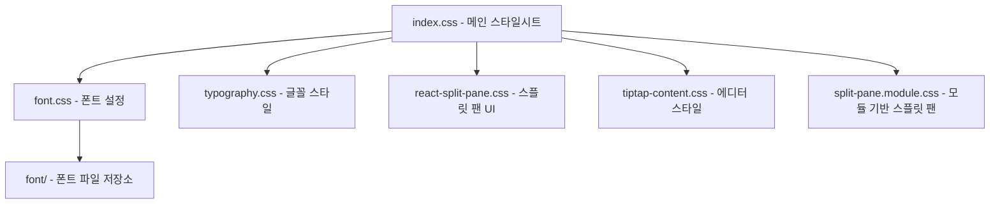

# services/modiplanet-gui/src/style 디렉토리 README

## 1. 제목 및 목적  
이 디렉토리는 **modiplanet-gui** 애플리케이션의 UI 스타일링을 담당합니다.  
- CSS 파일과 폰트 자산을 통해 UI의 시각적 일관성과 구성 요소 스타일을 제공합니다.  
- 전체 프로젝트에서 GUI의 레이아웃, 타이포그래피, 스플릿 팬, 에디터 컨텐츠 등의 디자인 기반을 제공합니다.  

---

## 2. 아키텍처  

---

## 3. 주요 컴포넌트  
| 파일 이름                | 설명                                                                 |
|-------------------------|----------------------------------------------------------------------|
| `index.css`             | 전체 스타일의 핵심 파일. 기본 레이아웃, 색상, 글꼴 등을 정의합니다.         |
| `font.css`              | `font/` 디렉토리에 있는 폰트 파일을 불러오는 설정 파일입니다.            |
| `typography.css`        | 글꼴 크기, 간격, 가중치 등 타이포그래피 관련 스타일을 정의합니다.        |
| `react-split-pane.css`  | 스플릿 팬 기능을 위한 UI 스타일(예: 창 분할 기능)을 제공합니다.         |
| `tiptap-content.css`    | 텍스트 에디터(Tiptap)의 컨텐츠 스타일을 정의합니다.                    |
| `split-pane.module.css` | CSS 모듈 기반의 스플릿 팬 스타일 정의 파일입니다.                      |
| `font/`                 | `PretendardVariable.woff2`, `Roboto` 폰트 파일을 저장하는 디렉토리입니다. |

---

## 4. 데이터 흐름 / 프로세스  
이 디렉토리는 **정적 자원**을 담당하므로 데이터 흐름은 해당되지 않습니다.  

---

## 5. API / 인터페이스  
이 디렉토리는 **공개 API**를 제공하지 않습니다.  
- 외부에서 사용할 수 있는 인터페이스는 없습니다.  
- 폰트 및 스타일은 내부적으로 `import` 또는 `@import`를 통해 사용됩니다.  

---

## 6. 의존성  
| 유형         | 설명                                                                 |
|--------------|----------------------------------------------------------------------|
| 내부 의존성  | `modiplanet-gui` 프로젝트의 다른 모듈에서 이 디렉토리의 CSS 파일을 참조합니다. |
| 외부 의존성  | `PretendardVariable.woff2`, `Roboto` 폰트 파일(외부 라이선스에 따라 제공). |

---

## 7. 실행 / 테스트 방법  
이 디렉토리는 **정적 파일**이므로 실행 명령어가 없습니다.  
- 테스트 시: CSS 파일이 정상적으로 로드되는지 확인(예: 브라우저 개발자 도구로 스타일 적용 여부 확인).